# Tracker 

일상 기록을 비교 가능한 데이터로 바꾸는 개인 트래킹 앱입니다.

## 해결하려는 문제 
수기로 작성하는 다이어리나 불렛저널은 하루의 일을 기록하기엔 편하지만, 과거의 데이터를 끌어오거나 기간에 걸쳐 분포된 데이터를 항시 가공하는것에 불리하다.
그렇기에 데이터가 존재해도 데이터간의 관계성을 객관적으로 추론하고 이용하기 어렵다.

또한 디지털방식의, 필요한 목적에 맞춰 표와 수식을 직접 구성해야하는 스프레드시트는 원하는 목적을 파악하고 효율적으로 구상하는 과정이 필요하다는 힘듦이 존재한다.

Tracker는 기록에 필요한 입력구조를 미리 구성해 일상의 지출·습관·컨디션을 일정한 구조로 기록하고, 짜여진 유용한 비교방식을 선택해 특정 기간의 데이터를 타임라인과 그래프로 보여주는 개인 트래킹 앱이다.
기록을 일일이 다시 살펴보거나 통계를 직접 계산하지 않아도 변화와 패턴을 확인할 수 있도록 만들었다.

## 주요 화면

### Daily

지출·습관·컨디션을 날짜별로 기록한다.

  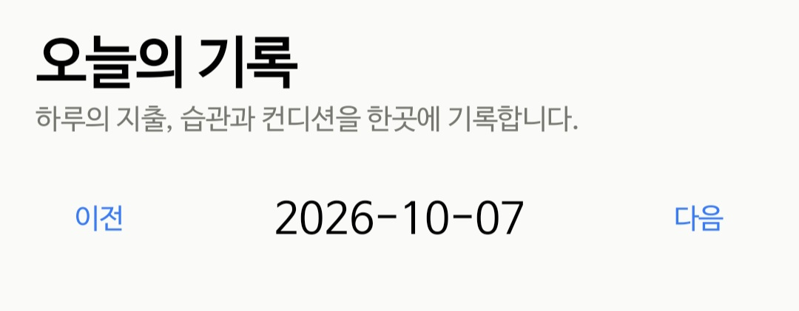

| 지출 기록 | 지출 입력 |
|:---:|:---:|
| 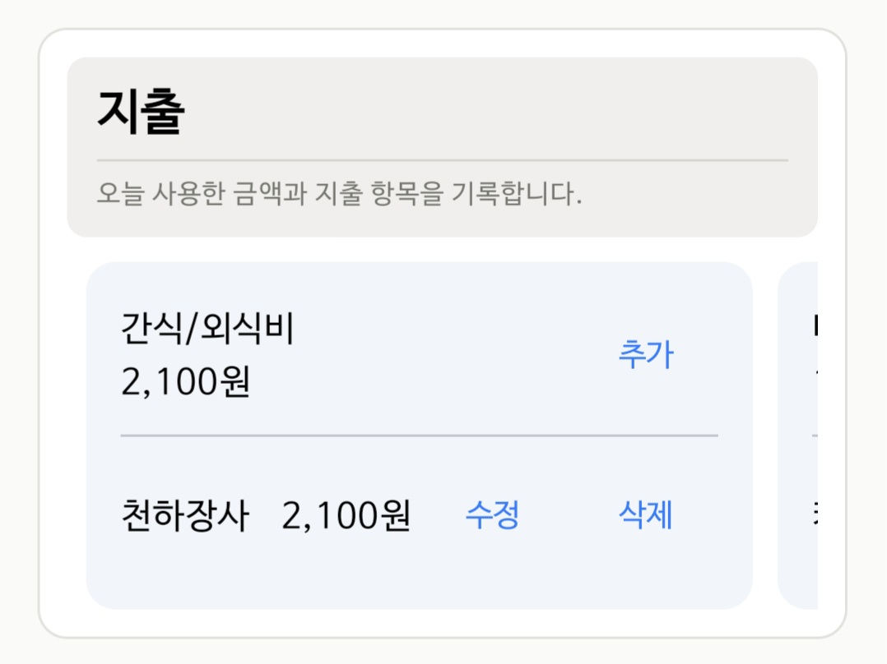 | 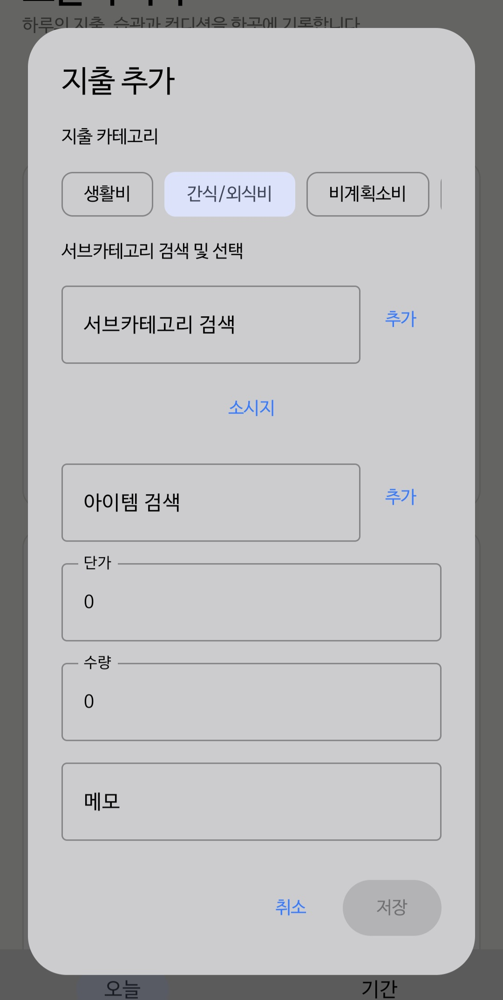 |

| 습관 기록 | 습관 입력 |
|:---:|:---:|
| 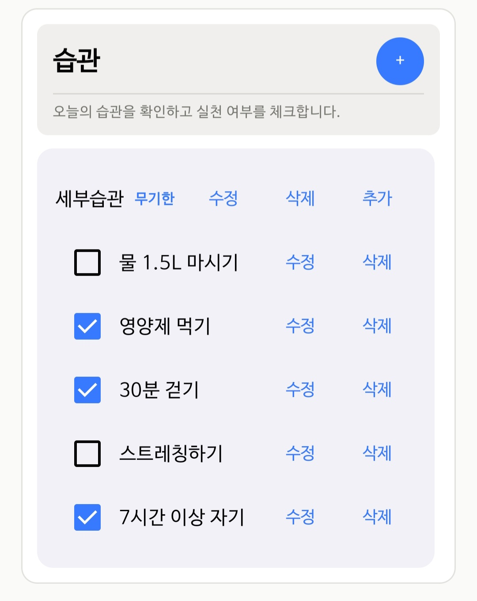 | 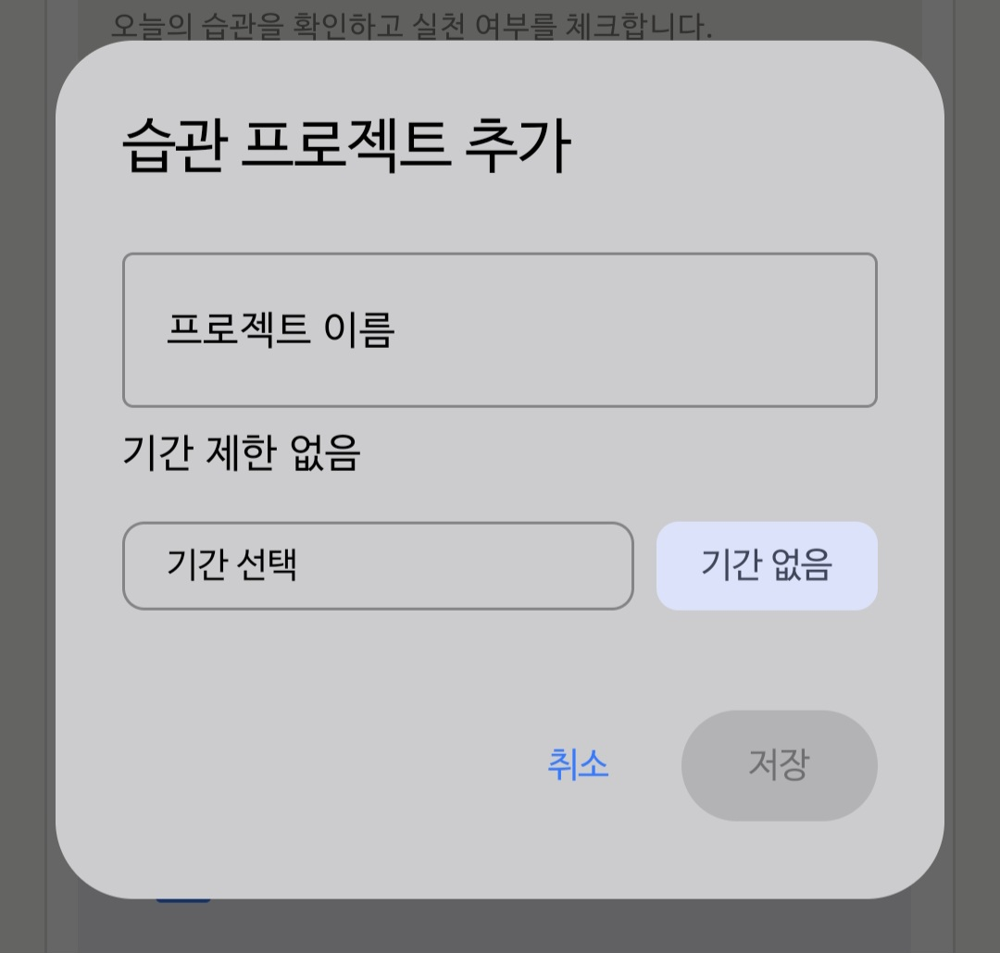 |

| 컨디션 기록 |
|:---:|
| 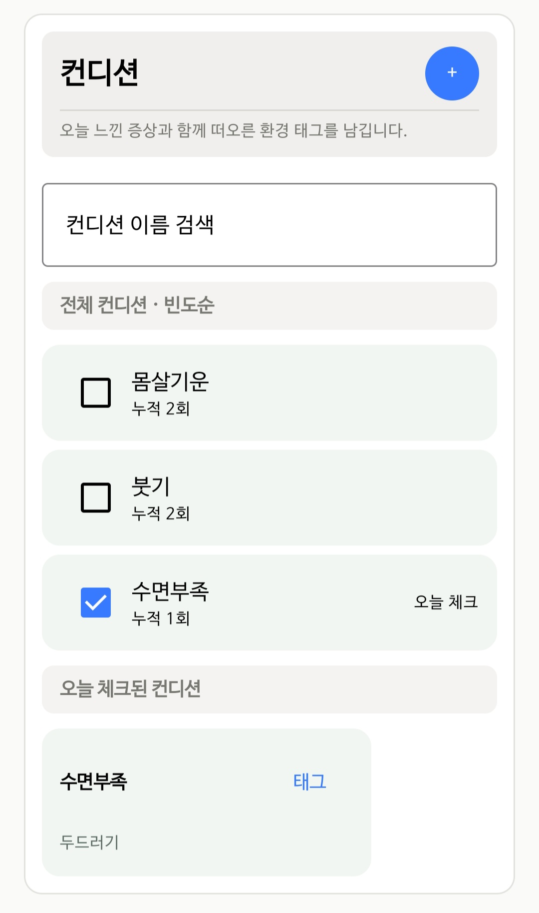 |

  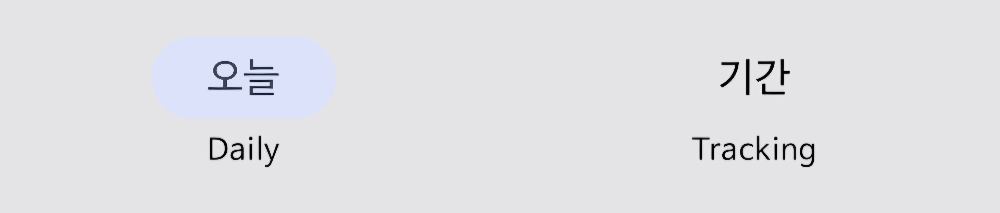

### Tracking

선택한 기간의 기록을 타임라인과 그래프로 비교한다.

| 기간 설정 | 지출 트래킹 요약 |
|:---:|:---:|
| 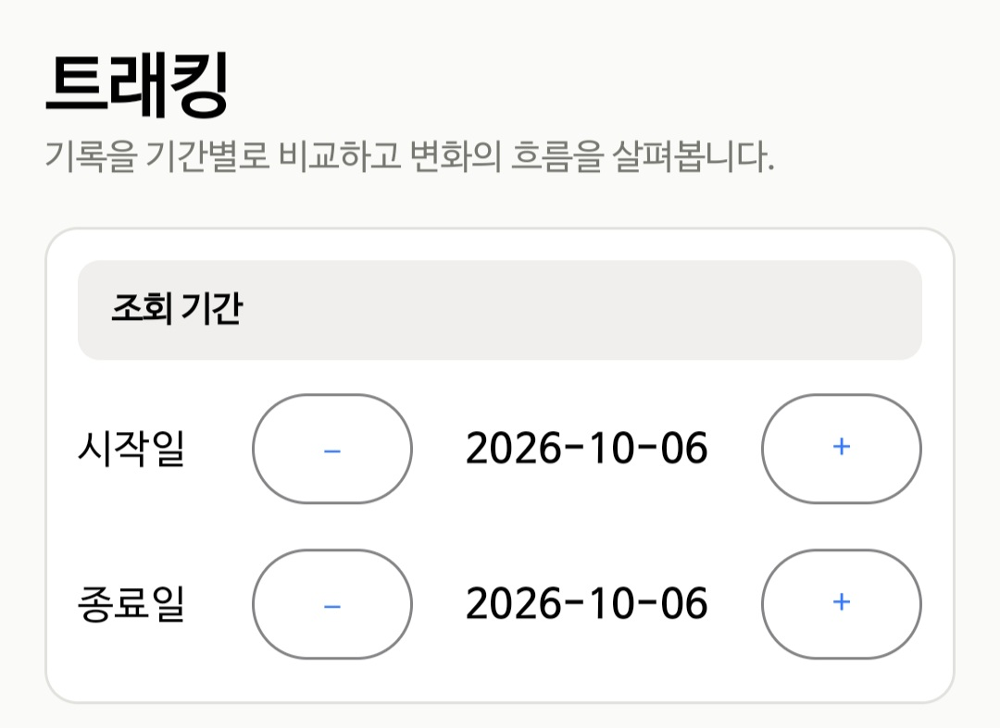 | 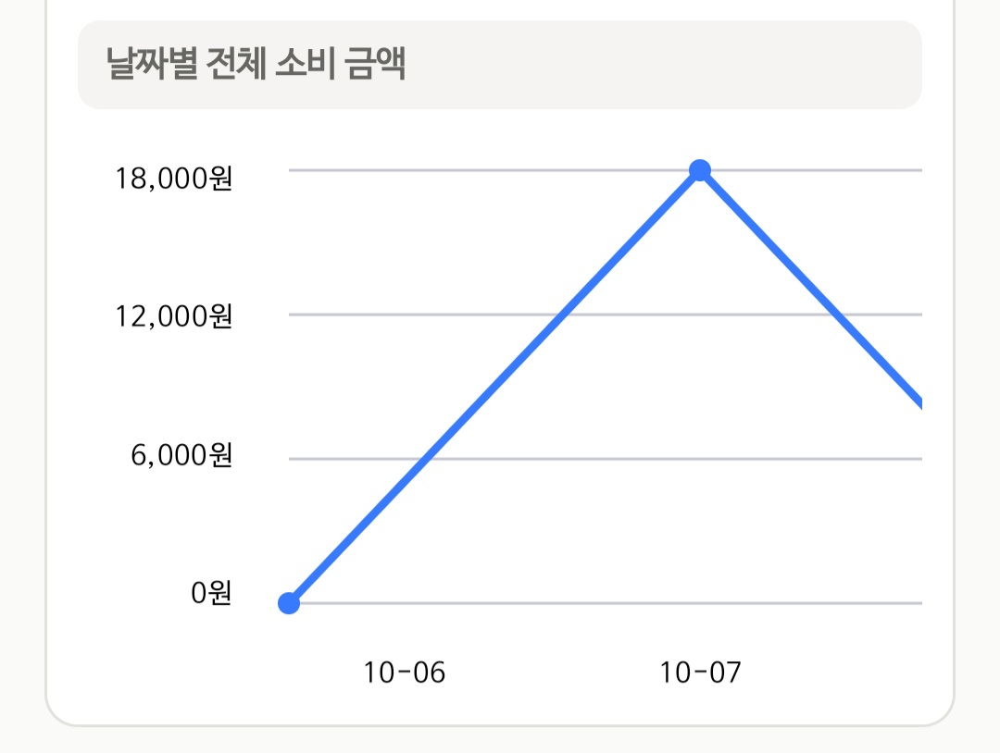 |

|                                    지출 트래킹                                     |                                    지출 원그래프                                    |
|:-----------------------------------------------------------------------------:|:-----------------------------------------------------------------------------:|
| 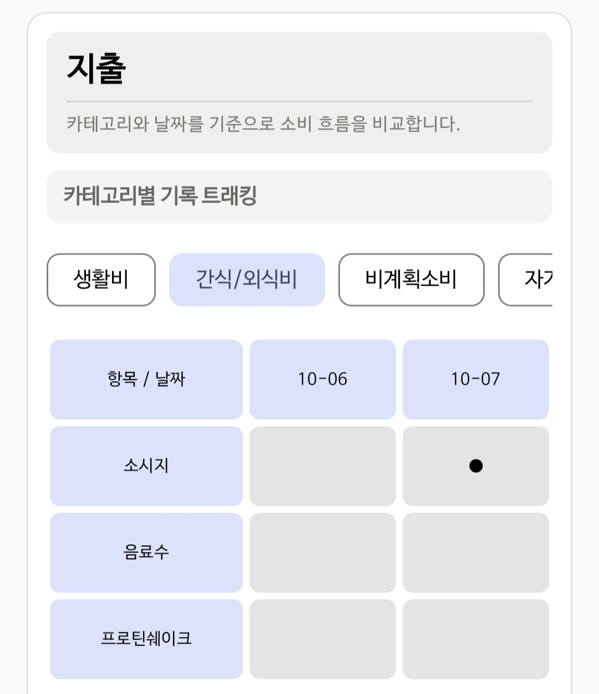 | 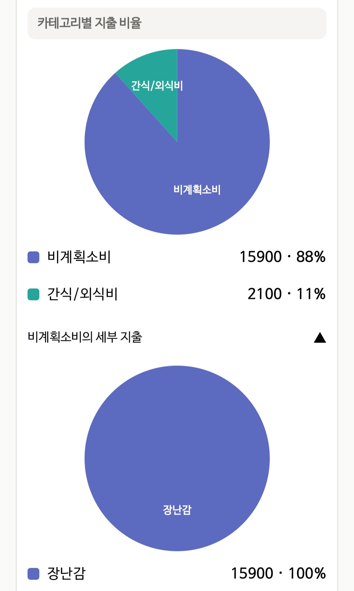 |

|                                    습관 월별                                    |                                   습관 트래킹                                    |
|:---------------------------------------------------------------------------:|:---------------------------------------------------------------------------:|
| 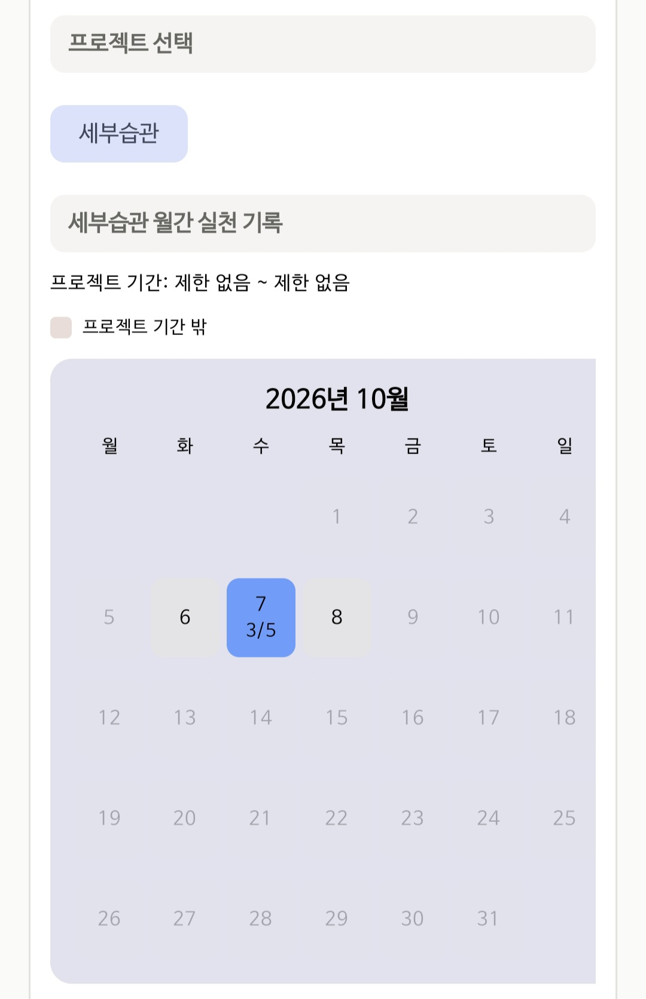 | 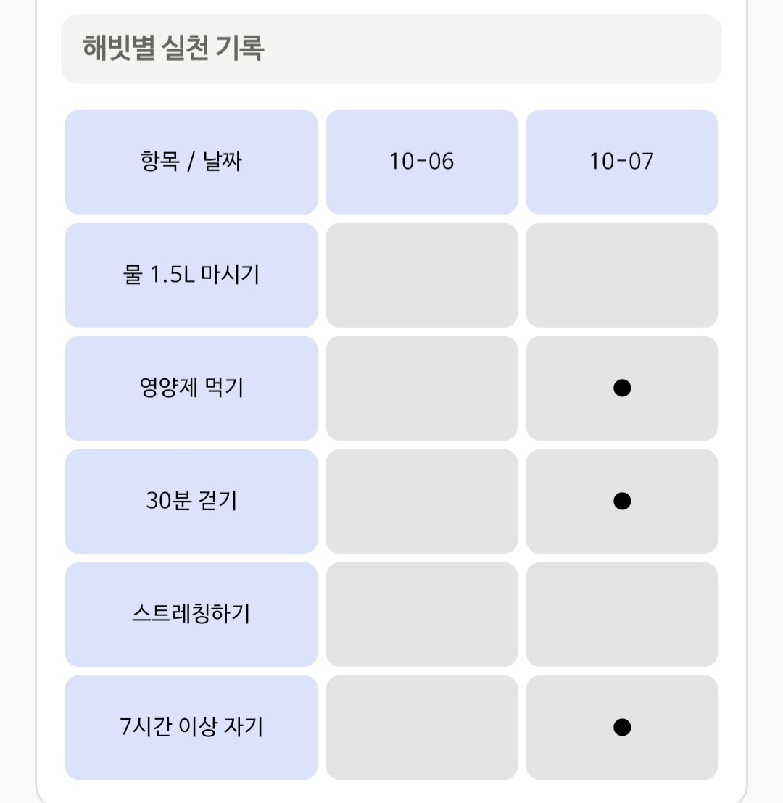 |

|                                     컨디션 트래킹                                      |                                컨디션 관련된 데피니션/태그 빈도                                |
|:--------------------------------------------------------------------------------:|:--------------------------------------------------------------------------------:|
| 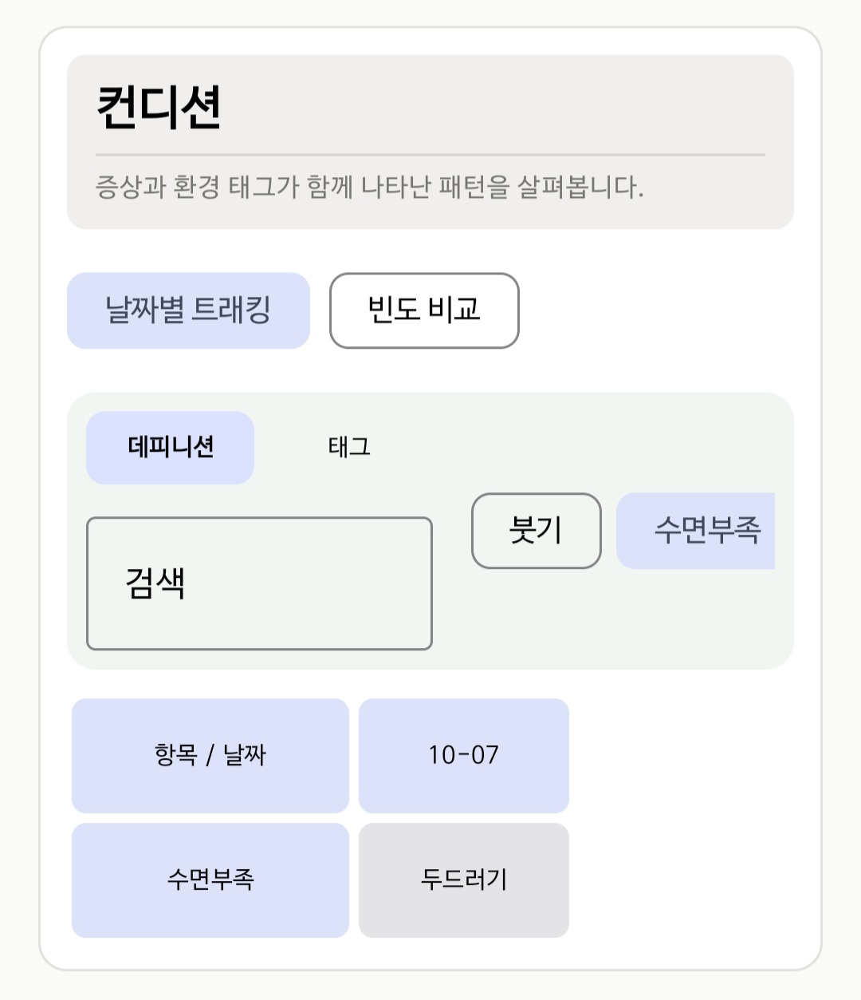 | 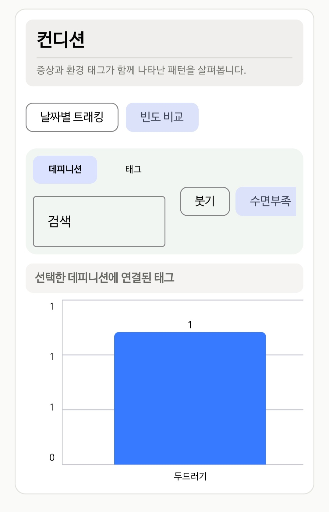 |

## 핵심 기능 
### 지출 
- 실제 구매 단가와 수량을 포함한 날짜별 지출 기록
- 카테고리·서브카테고리별 지출 비율과 날짜별 소비 추이 시각화
- 동일한 조건의 지출은 수량으로 합치고, 구매 단가가 다르면 별도 기록으로 관리

### 습관 

- 하나의 프로젝트를 여러 세부 습관으로 나누어 관리
- 프로젝트 기간과 남은 기간을 D-day로 표시
- 날짜별 실천 여부와 월간 달성 정도를 트래킹 화면에서 확인
- 프로젝트 기간 밖의 날짜와 실천하지 않은 날짜를 시각적으로 구분

### 컨디션 

- 날짜별 증상과, 증상마다 관련이 있다고 의심되는 여러 환경 태그들을 함께 기록
- 자주 기록하는 증상을 빈도순으로 노출
- 증상별 태그와 태그별 증상을 각각 날짜·빈도 기준으로 비교

## 사용 기술 
Language
- Kotlin

UI
- Jetpack Compose
- Material 3

Architecture
- ViewModel
- 단방향 상태 흐름
- UI State
- Kotlin Coroutines

Data
- Room
- SQLite
- DAO
- Entity / DTO
- 관계형 데이터 모델링
- Room Migration

Build
- Gradle
- Android Studio

## 데이터 흐름 

### 입력 데이터 

사용자가 입력 중인 값은 Compose의 로컬 상태 또는 ViewModel의 `UiState`에 보관된다. 저장 버튼을 누르면 ViewModel이 입력값을 검증하고 Entity로 변환한 뒤, DAO를 통해 Room에 저장한다.

`사용자 입력 → Compose 상태 → ViewModel → DAO → Room`

### 조회 데이터 
트래킹 화면에서 선택한 기간과 검색 조건은 viewModel로 전달된다. viewModel은 전달받은 데이터를 dao에 가공해 입력, 쿼리를 통해 Room 데이터를 Entity 혹은 DTO 형태로 조회한다. 조회된 데이터는 UI State의 형태에 맞춰 재구성되고 반영된다. Compose UI는 이 상태를 읽어 목록과 그래프로 표시한다.

`Room → Entity·DTO → ViewModel 데이터 조합 → UiState → Compose UI`

## 어려웠던 문제와 해결 과정
### 입력 폼과 데이터 저장 시점 분리 
처음 ViewModel을 작성할 때에는 추가 버튼을 누르면 Record를 먼저 생성하고, 팝업에서 나머지 정보를 입력하도록 구현했다. 그러나 사용자가 입력 도중 팝업을 닫으면 미완성 Record가 DB에 남기 때문에, 이를 다시 찾아 삭제해야 하는 문제가 있었다.

처음에는 팝업을 연 시점부터 저장할 때까지의 과정을 트랜잭션으로 처리하는 방법을 생각했다. 하지만 트랜잭션은 여러 DB 작업의 성공과 실패를 하나의 단위로 묶는 기능이기때문에, 사용자의 입력을 기다리는 UI 흐름을 관리하기에는 적합하지 않았다.

문제의 원인이 팝업을 여는 동작과 데이터를 저장하는 동작을 하나로 처리한 데 있다고 판단했다. 따라서 팝업을 열 때에는 DB를 변경하지 않고 State에 빈 Form을 생성하고, 사용자가 입력한 값도 임시 상태로 관리하도록 변경했다. 저장 버튼을 누른 경우에만 Form을 ViewModel로 전달하고, ViewModel이 이를 Entity로 변환하여 DAO를 통해 저장한다. 입력을 취소하면 임시 Form만 제거한다.

이를 통해 팝업의 표시 여부, 작성 중인 입력값, DB에 확정된 데이터를 구분하고 미완성 Record가 저장되는 문제를 제거했다.

### 지출 중복 처리 기준에 단가 추가 

초기에는 사용자가 지출 내역을 쉽게 파악할 수 있도록, 같은 날짜에 동일한 아이템과 서브카테고리로 지출을 여러 번 입력하면 수량을 증가시켜 하나의 Record로 합치도록 구현했다. 그러나 같은 조건의 지출이라도 할인이나 쿠폰 등에 따라 실제 구매 단가는 달라질 수 있었고, 기존의 중복 판단 기준은 이러한 차이를 구분하지 못했다.

아이템에 저장된 기본 가격은 반복 입력을 돕기 위한 참고값인 반면, 지출 Record의 단가는 구매 당시 실제로 지불한 가격이다. 따라서 다른 조건이 같더라도 실제 구매 단가가 다르면 서로 다른 Record로 처리하기로 결정했다. 따라서 날짜·아이템·서브카테고리뿐 아니라 단가까지 같을 때만 수량을 합치도록 중복 판단 기준을 변경했다.

이를 위해 Entity의 복합 고유 인덱스와 DAO의 중복 조회 조건에 `unitPrice`를 추가했다. 스키마 변경 이후에도 기존 데이터를 유지할 수 있도록 데이터베이스 버전을 올리고 Room Migration을 작성했다.

### 중첩 팝업의 결과를 기존 입력 폼에 반영 
지출 입력 팝업에서 새로운 서브카테고리가 필요하면 별도의 추가 팝업을 열도록 구성했다. 이때 사용자가 작성 중인 아이템·단가·수량은 Compose의 로컬 `draft`에 있었지만, 새로 생성한 서브카테고리는 DB에 저장된 후 ViewModel의 `expenseRecordForm`을 통해 첫 번째 팝업의 `initialForm`으로 전달됐다.

같은 Record를 편집하는 동안에는 `remember(recordId)`가 기존 `draft`를 유지하므로, 변경된 `initialForm` 전체로 로컬 입력값이 교체되지는 않는다. 대신 새로 생성된 서브카테고리도 `draft`에 자동으로 반영되지 않았다.

아이템·단가·수량·서브카테고리를 각각 독립적인 로컬 State로 관리하고 저장 시 다시 Form으로 조합하는 방법도 고려할 수 있었다. 그러나 입력 필드마다 상태와 초기화 조건을 별도로 관리해야 하므로, 작성 중인 값을 하나의 `draft`로 유지하고 외부에서 변경된 필드만 선택적으로 반영하는 방식을 사용했다.

이를 위해 `initialForm`의 서브카테고리 ID와 이름을 `LaunchedEffect`의 key로 지정했다. 해당 값이 변경된 경우에만 기존 `draft`에 서브카테고리 필드를 병합하여, 작성 중인 값을 유지하면서 두 번째 팝업의 결과를 첫 번째 팝업에 반영했다.

### 컨디션 Definition과 Tag의 관계 재설계 

초기에는 컨디션 Definition에 Tag를 직접 연결하도록 설계했다. 그러나 개발 과정에서 Definition은 사용자가 느낀 증상, Tag는 해당 증상과 관련이 있다고 의심한 환경 요소로 역할을 구분하게 됐다.

기존 구조에서는 날짜와 관계없이 증상 자체에 환경 Tag가 연결되므로, 여러 날짜의 기록을 비교하기도 전에 특정 증상과 환경의 관계를 미리 확정하게 되는 문제가 있었다. 이는 기록을 쌓은 뒤 증상과 환경 사이에서 반복되는 관계를 찾아보려는 트래킹의 목적과 맞지 않았다. 따라서 Definition과 Tag의 직접적인 연결을 제거했다.

또한 사용자는 환경과 증상을 각각 독립적으로 떠올리기보다, 증상을 느낀 순간 “이 환경 때문인가?”라는 의문을 함께 갖는다고 보았다. 이러한 기록 흐름을 유지하기 위해 Tag를 증상 그날 발생한 증상인 Record에 연결하도록 구조를 변경했다.

하나의 Record에는 하나의 Definition과 여러 Tag를 연결할 수 있도록 구성하여, 같은 증상이라도 날짜마다 서로 다른 환경 요소를 기록하고 이후 트래킹 화면에서 반복되는 관계를 비교할 수 있게 했다. 대신 동일한 증상을 기록할 때마다 Tag를 다시 선택해야 하므로 입력 과정이 길어질 수 있다는 한계가 있다.

## 주요 설계 결정 
(문제를 보고 여러 방법 중 하나를 선택했으며, 그 선택의 이유와 단점을 설명할 수 있는가?)

### 체크되지 않은 항목은 별도의 false 행 대신 Record 부재로 표현 
모든 날짜와 항목들의 조합을 미리 만들어두면, 데이터 수가 `날짜 수 × 항목 수`만큼 증가하기때문에 체크한 항목만 관리하는것에 비해 비효율적이다.
그렇기 때문에 날짜별로, 모든 항목들에 대해, `checked = false`인 record를 미리 생성하는 대신 실제로 체크된 경우에만 Record를 생성하도록 설계했다.

### 습관을 프로젝트와 세부 Definition으로 분리 
큰 목표를 구체적인 실천 항목으로 나누는 방식에 맞춰 습관을 프로젝트와 세부 Definition의 계층으로 구성했다. 트래킹화면에서 프로젝트 기간 밖의 날짜를 시각적으로 구분하여 '하지않은날'과 '목표가 없던날'을 쉽게 구별할 수 있게 하였다.
다만 현재는 개별 습관마다 별도의 기간을 설정할 수 없다.

### 지출 카테고리를 고정하여 입력 시 판단 비용 축소 
카테고리는 지출의 성격을 분리하기 위한 목적으로 만들었으며, 이 과정에서는 사용자의 판단이 계속해서 들어간다. 사용자가 카테고리부터 직접 설정할 수 있으면 지출의 성격을 판단하는 과정이 설정단계를 넘어 기록단계에서도 계속될수있다고 생각했다. 이를 기록의 저항을 올리는 장애물이라 판단하여 정해진 틀을 미리 제공하도록 결정하였다.

### DAO의 조회 결과를 ViewModel에서 화면 데이터로 조합 
화면마다 필요한 데이터들을 dao를 통해 바로 받으면, 기능이 추가될때마다 매번 쿼리를 추가하여야하고, dto의 재사용이 떨어진다. 또, 관계형 조회 결과는 기본적으로 단순 행 단위이므로 후가공이 필요했다.
따라서 dao와 특정 화면 사이에 viewModel의 데이터 조합, 형태 가공의 단계를 놓는 방식으로 설계하였다.
이 방식은 기존 조회를 여러 화면에서 재사용하기 쉽다는 장점이 있지만, ViewModel의 가공 코드가 길어지고 여러 조회의 결과를 일관되게 결합해야 한다는 부담이 있다.

### 아이템의 기본 가격과 실제 구매 단가를 분리 
아이템의 기본 설정 입력은 반복 사용시 유용하기 위한 참고용이며 실제 구매시의 지출과 다를 시 지출 record에 구매 당시 단가를 별도로 저장했다. 그렇기에 같은 날에 같은 아이템을 구매했더라도 다른 단가로 구매시 별개의 지출로 저장하고, 최종 구매 단가가 같은 경우에만 수량을 합치도록 구성했다.

## 현재 한계와 향후 개선점 

- **트래킹 화면의 높은 정보 밀도**  
  여러 종류의 그래프와 기록이 한 화면에 배치되어 처음 사용하는 사람이 각 기능과 그래프의 의미를 파악하기 어렵다. 트래킹 목적과 그래프 해석 방법을 설명하는 온보딩을 추가하고, UI 컴포넌트를 개선할 예정이다.

- **개별 습관의 기간 설정 불가**  
  현재는 프로젝트 전체에만 기간을 지정할 수 있어, 하나의 프로젝트에 속한 습관마다 서로 다른 시작일과 종료일을 설정할 수 없다. 일정 기간 이상 사용 후 필요하다고 판단되면 개별 Definition에도 기간을 지정할 수 있도록 데이터 구조를 확장할 예정이다.

- **고정된 상위 지출 카테고리**  
  기록할 때의 판단 비용을 줄이기 위해 상위 카테고리를 고정했지만, 사용자의 생활 방식에 맞춰 분류 체계를 확장하기 어렵다. 기본 카테고리는 유지하면서 사용자가 일부 항목을 추가하거나 수정할 수 있는 방식을 고려하고 있다.

- **수동 입력 비용**  
  기록 항목이 많아질수록 지출과 생활 기록을 직접 입력하는 데 시간이 많이 필요하다. 영수증 OCR을 이용한 지출 자동 입력과 기존 아이템의 유사도 판별 기능을 추가해 반복 입력을 줄일 예정이다.

- **입력 초안 보존 범위**  
  일부 팝업의 입력값은 Compose의 로컬 상태에 보관되므로 화면 회전이나 프로세스 재생성 시 사라질 수 있다. `rememberSaveable` 또는 ViewModel을 이용해 작성 중인 입력값을 보존하도록 개선할 예정이다.

- **테스트 부족**  
  현재는 실제 기기에서의 수동 검증을 중심으로 동작을 확인하고 있다. 금액 계산과 ViewModel의 데이터 조합 로직에는 단위 테스트를, DAO와 Migration에는 통합 테스트를 추가할 예정이다.

- **기록 정리 기능의 한계**  
  카테고리·습관·컨디션 항목이 늘어나면 사용자가 직접 중복 항목을 정리하고 분류해야 한다. 향후 AI를 활용한 분류 및 기록 정리 보조 기능을 검토하고 있다.

## 실행 방법 

1. 저장소를 clone한다.
2. Android Studio에서 프로젝트를 연다.
3. Gradle Sync가 완료될 때까지 기다린다.
4. Android 기기 또는 Emulator를 선택한다.
5. `app` 구성을 실행한다.

별도의 서버와 API Key는 필요하지 않으며, 기록은 Room을 통해 기기 내부에 저장된다.
